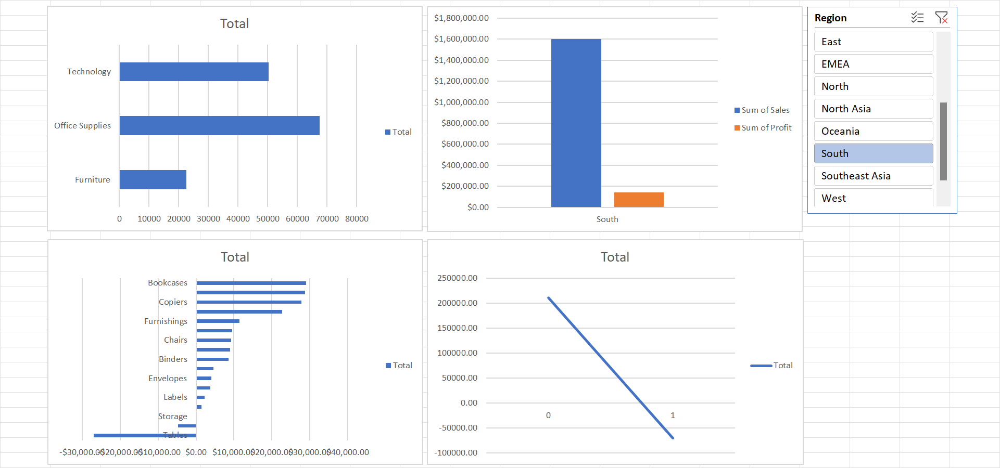

# Analisis Penjualan & Profitabilitas Superstore Menggunakan Excel

Proyek ini menganalisis data penjualan "Superstore" selama empat tahun untuk mengidentifikasi tren, profitabilitas produk, dan kinerja wilayah. Seluruh proses, dari pembersihan data hingga dashboard interaktif, dilakukan sepenuhnya di Microsoft Excel.

---

## Pendekatan dan Tools yang Digunakan

Proses analisis ini mencakup tiga tahap utama:

1.  **Pembersihan Data:** Menggunakan **Power Query** untuk mengambil, membersihkan, dan mentransformasi data mentah (termasuk memperbaiki tipe data dan format tanggal).
2.  **Analisis Data:** Menerapkan **PivotTable** untuk meringkas data dan mengidentifikasi pola serta temuan kunci.
3.  **Visualisasi:** Membangun dashboard interaktif menggunakan **PivotChart** dan **Slicer** untuk memfilter data secara dinamis.

---

## Temuan Utama (Key Findings)

Analisis ini menghasilkan beberapa temuan bisnis sebagai berikut:

* **Kerugian pada Kategori Meja:** Sub-kategori `Tables` (Meja) teridentifikasi sebagai satu-satunya kategori yang merugi secara signifikan, dengan total kerugian **-$64,083**.
* **Dampak Negatif Diskon:** Ditemukan korelasi kuat antara tingkat diskon dan profitabilitas. Margin keuntungan menurun drastis dan menjadi negatif ketika tingkat diskon mencapai **30% (0.3) ke atas**.
* **Kinerja Wilayah 'Central':** Wilayah `Central` menunjukkan kinerja terbaik, memimpin baik dari segi total penjualan maupun total profit.

---

## Rekomendasi Bisnis

Berdasarkan temuan di atas, berikut adalah beberapa rekomendasi:

1.  **Tinjau Ulang Strategi Diskon:** Melakukan evaluasi segera terhadap strategi diskon di atas 20% (0.2), terutama untuk sub-kategori `Tables`.
2.  **Analisis Wilayah 'Central':** Mengidentifikasi faktor kesuksesan di wilayah `Central` untuk diterapkan di wilayah lain yang kinerjanya kurang.
